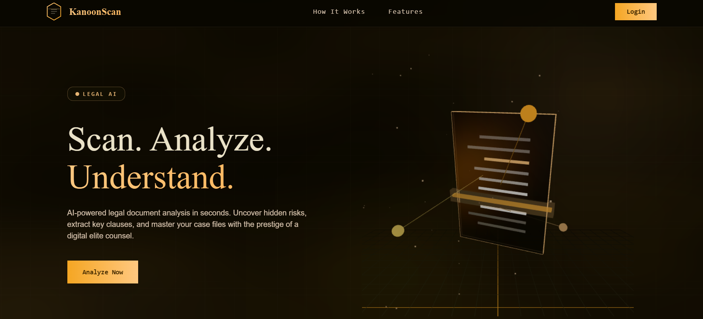
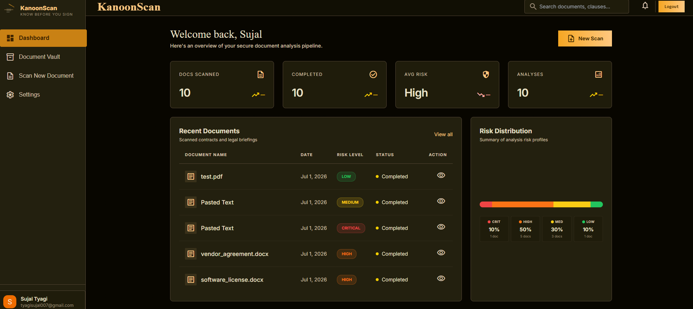
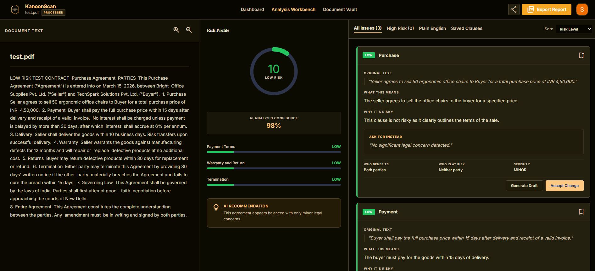
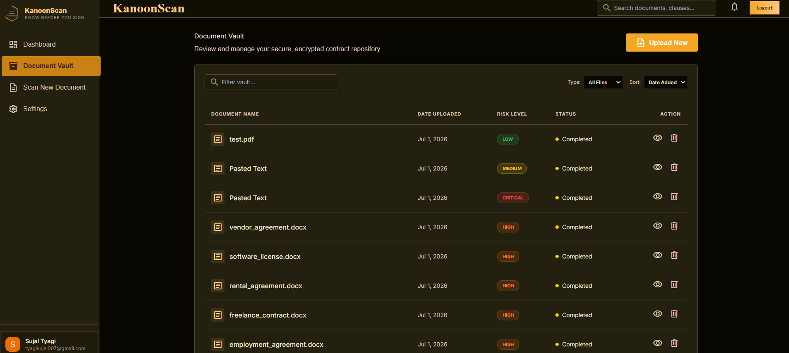

# ⚖️ KanoonScan

> **Know Before You Sign**

An AI-powered Legal Contract Analyzer that helps users understand legal agreements by identifying key clauses, assessing contractual risks, generating plain-English summaries, and producing professional legal reports.

<p align="center">
  <a href="https://kanoonscan.vercel.app/">
    
  </a>
  
  
</p>

---

## 📸 Screenshots
### Landing Page



---
### Dashboard



---

### Contract Analysis



---

### Document Vault



---

## ✨ Features

* **AI Analysis**: Instantly detects and analyzes key legal clauses.
* **Format Support**: Upload PDF, DOCX, and TXT agreements.
* **Risk Scoring**: Provides a 0-100 score and assigns a low/medium/high/critical risk category.
* **Plain English Summaries**: Translates complex legalese into clear text.
* **Smart Actions**: Get recommendations, who benefits, and who is at risk.
* **Document Vault**: Save, manage, and delete analyzed contracts safely.
* **PDF Reports**: Export results into clean, print-friendly reports. 

---

## 🛠️ Tech Stack

- **Frontend:** Next.js 14, TypeScript, Tailwind CSS
- **Backend:** Next.js App Router
- **Database:** MongoDB
- **Authentication:** Clerk
- **AI Models:** Google Gemini, Groq (Llama)
- **Document Parsing:** PDF.js, Mammoth
- **File Uploads:** UploadThing

---

## 📊 Risk Levels

| Level | Description |
|--------|-------------|
| 🟢 Low | Standard commercial terms with minimal legal concerns |
| 🟡 Medium | Clauses that should be reviewed before signing |
| 🟠 High | Significant contractual risks requiring attention |
| 🔴 Critical | Serious legal concerns requiring professional review |

---

## 📁 Project Structure

```text
app/
components/
lib/
actions/
models/
public/
```

---

## 👨‍💻 Author

**Sujal Tyagi**

---

## 📄 License

This project is licensed under the MIT License.